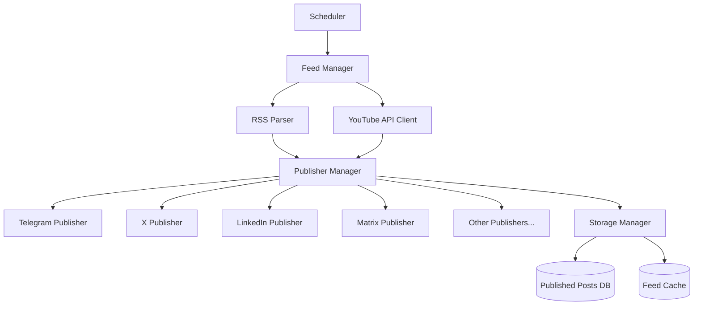

# 🚀 Populatrs - RSS Feed Publisher

<div align="center">

[](https://github.com/populatrs/populatrs/actions)
[](LICENSE)
[](https://www.rust-lang.org)
[](https://hub.docker.com/r/populatrs/populatrs)
[](https://github.com/populatrs/populatrs/releases)

_Automated RSS feed publisher for multiple social platforms with intelligent caching and robust retry mechanisms_

[Features](#-features) • [Quick Start](#-quick-start) • [Installation](#-installation) • [Configuration](#-configuration) • [Documentation](#-documentation)

</div>

---

## 📋 Table of Contents

- [Features](#-features)
- [Supported Platforms](#-supported-platforms)
- [Quick Start](#-quick-start)
- [Installation](#-installation)
- [Configuration](#-configuration)
- [OAuth 2.0 Setup](#-oauth-20-setup)
- [Template System](#-template-system)
- [HTTP Optimizations](#-http-optimizations)
- [Docker Usage](#-docker-usage)
- [CLI Commands](#-cli-commands)
- [Monitoring](#-monitoring)
- [Contributing](#-contributing)
- [License](#-license)

## ✨ Features

### 📡 Multi-Source Feed Processing

- **RSS/Atom**: Complete support for RSS 2.0 and Atom feeds
- **YouTube API v3**: Direct integration with YouTube Data API
  - Channel feeds by ID, username or custom URL
  - Playlist monitoring
  - Automatic metadata extraction
- **Smart ordering**: Posts published chronologically (oldest to newest)

### 🎯 8 Publishing Platforms

| Platform        | Auth Method    | Features                                |
| --------------- | -------------- | --------------------------------------- |
| **Telegram**    | Bot Token      | Topics, HTML formatting, thread support |
| **X (Twitter)** | OAuth 2.0 PKCE | Character limits, media support         |
| **Mastodon**    | Bearer Token   | Any instance, rich formatting           |
| **LinkedIn**    | OAuth 2.0      | Personal/Organization posts             |
| **Matrix**      | Access Token   | HTML messages, room targeting           |
| **Bluesky**     | App Password   | Decentralized posting                   |
| **Threads**     | Access Token   | Meta's text platform                    |
| **OpenObserve** | API Key        | Structured logging                      |

### 🔐 Advanced OAuth 2.0 Support

- **Interactive CLI setup** for LinkedIn & X/Twitter
- **PKCE flow** for enhanced security (X/Twitter)
- **Automatic token refresh** with persistent storage
- **Organization detection** for LinkedIn business accounts

### ⚡ Performance & Reliability

- **HTTP Caching**: ETag, If-None-Match, Last-Modified headers
- **Content Deduplication**: MD5 hashing for change detection
- **Exponential Backoff**: Configurable retry mechanisms
- **Rate Limiting**: Respectful API usage patterns
- **Concurrent Publishing**: Parallel execution across platforms

### 🎨 Advanced Template Engine (Jinja2)

```jinja2
{{ title | truncate(240) }}

{{ description | strip_html | truncate(400) }}

🔗 {{ url }}
#RSS #Automation
```

**Available Filters:** `truncate`, `word_limit`, `strip_html`  
**Variables:** `title`, `description`, `url`, `published`, `feed_id`

## 🏗 Supported Platforms

<div align="center">

| Platform    | Logo                                                                                                          | Status    | Auth Method    |
| ----------- | ------------------------------------------------------------------------------------------------------------- | --------- | -------------- |
| Telegram    |                   | ✅ Active | Bot Token      |
| X (Twitter) |                     | ✅ Active | OAuth 2.0 PKCE |
| Mastodon    |  | ✅ Active | Bearer Token   |
| LinkedIn    |          | ✅ Active | OAuth 2.0      |
| Matrix      |                     | ✅ Active | Access Token   |
| Bluesky     |                    | ✅ Active | App Password   |
| Threads     | 🧵                                                                                                            | ✅ Active | Access Token   |
| OpenObserve | 📊                                                                                                            | ✅ Active | API Key        |

</div>

## 🚀 Quick Start

### Prerequisites

- **Rust 1.70+** ([Install Rust](https://rustup.rs/))
- **System dependencies**:

  ```bash
  # Ubuntu/Debian
  sudo apt update && sudo apt install -y build-essential pkg-config libssl-dev

  # macOS
  brew install openssl pkg-config
  ```

### 1. Download & Build

```bash
git clone https://github.com/yourusername/populatrs.git
cd populatrs
cargo build --release
```

### 2. Configure

```bash
cp config.example.json config.json
# Edit config.json with your feeds and publishers
```

### 3. Setup OAuth (Optional)

```bash
# LinkedIn OAuth setup
./target/release/populatrs --linkedin-oauth --linkedin-publisher linkedin-main

# X/Twitter OAuth setup
./target/release/populatrs --x-oauth --x-publisher x-main
```

### 4. Run

```bash
# Test run (execute once)
./target/release/populatrs --once

# Production (continuous monitoring)
./target/release/populatrs
```

## 📦 Installation

### Method 1: Cargo Install

```bash
cargo install --git https://github.com/yourusername/populatrs.git
```

### Method 2: Docker

```bash
docker pull populatrs/populatrs:latest
```

### Method 3: Binary Releases

Download from [GitHub Releases](https://github.com/yourusername/populatrs/releases)

### Method 4: Build from Source

```bash
git clone https://github.com/yourusername/populatrs.git
cd populatrs
cargo build --release
sudo cp target/release/populatrs /usr/local/bin/
```

## ⚙️ Configuration

### Basic Configuration Structure

```json
{
  "youtube": {
    "api_key": "YOUR_YOUTUBE_API_KEY",
    "default_max_results": 10
  },
  "feeds": [
    {
      "id": "my-blog",
      "type": "Rss",
      "config": { "url": "https://myblog.com/feed.xml" },
      "name": "My Blog",
      "enabled": true,
      "publishers": ["telegram-main", "x-main"],
      "check_interval_minutes": 30
    },
    {
      "id": "my-youtube",
      "type": "Youtube",
      "config": { "channel_id": "UCChannelID123" },
      "name": "My YouTube Channel",
      "enabled": true,
      "publishers": ["linkedin-main"],
      "check_interval_minutes": 60
    }
  ],
  "publishers": {
    "telegram-main": {
      "type": "Telegram",
      "config": {
        "bot_token": "123456:ABC-DEF...",
        "chat_id": "@yourchannel",
        "template": "**{{ title }}**\\n\\n{{ description | truncate(400) }}\\n\\n🔗 {{ url }}"
      }
    }
  },
  "schedule": {
    "default_interval_minutes": 60,
    "timezone": "UTC"
  },
  "storage": {
    "data_dir": "./data",
    "published_posts_file": "published_posts.json"
  }
}
```

### Publisher Configuration Examples

<details>
<summary><strong>🤖 Telegram</strong></summary>

```json
{
  "type": "Telegram",
  "config": {
    "bot_token": "123456:ABC-DEF1234ghIkl-zyx57W2v1u123ew11",
    "chat_id": "@yourchannel",
    "parse_mode": "HTML",
    "message_thread_id": "123",
    "template": "<b>{{ title }}</b>\\n\\n{{ description | truncate(400) }}\\n\\n🔗 <a href='{{ url }}'>Read more</a>"
  }
}
```

</details>

<details>
<summary><strong>🐦 X (Twitter)</strong></summary>

```json
{
  "type": "X",
  "config": {
    "client_id": "YOUR_CLIENT_ID",
    "client_secret": "YOUR_CLIENT_SECRET",
    "access_token": null,
    "refresh_token": null,
    "template": "🚀 {{ title | truncate(210) }}\\n\\n🔗 {{ url }} #RSS"
  }
}
```

</details>

<details>
<summary><strong>🐘 Mastodon</strong></summary>

```json
{
  "type": "Mastodon",
  "config": {
    "server_url": "https://mastodon.social",
    "access_token": "YOUR_ACCESS_TOKEN",
    "template": "{{ title }}\\n\\n{{ description | truncate(400) }}\\n\\n{{ url }}"
  }
}
```

</details>

<details>
<summary><strong>💼 LinkedIn</strong></summary>

```json
{
  "type": "LinkedIn",
  "config": {
    "client_id": "YOUR_CLIENT_ID",
    "client_secret": "YOUR_CLIENT_SECRET",
    "access_token": null,
    "refresh_token": null,
    "user_id": null,
    "template": "{{ title }}\\n\\n{{ description | truncate(700) }}\\n\\nRead more: {{ url }}"
  }
}
```

</details>

## 🔐 OAuth 2.0 Setup

### LinkedIn OAuth 2.0

**Interactive CLI setup** for seamless configuration:

```bash
./target/release/populatrs --linkedin-oauth --linkedin-publisher linkedin-main
```

**Process:**

1. 🌐 Opens LinkedIn authorization URL automatically
2. 🔐 Login and authorize the application
3. 📋 Copy authorization code from callback URL
4. ✅ Tokens saved automatically to config file

### X (Twitter) OAuth 2.0 with PKCE

**Secure PKCE flow** for enhanced security:

```bash
./target/release/populatrs --x-oauth --x-publisher x-main
```

**Process:**

1. 🔒 Generates PKCE challenge automatically
2. 🌐 Opens X authorization URL
3. 🔐 Authorize application on X/Twitter
4. 📋 Enter authorization code
5. ✅ OAuth tokens with refresh capability saved

### Required Pre-Configuration

Before running OAuth setup, ensure your `config.json` has the client credentials:

```json
{
  "publishers": {
    "linkedin-main": {
      "type": "LinkedIn",
      "config": {
        "client_id": "78se6i61p0gmlo",
        "client_secret": "YOUR_CLIENT_SECRET",
        "redirect_uri": "http://localhost:8080/callback",
        "access_token": null,
        "refresh_token": null,
        "user_id": null
      }
    }
  }
}
```

## 🎨 Template System

Populatrs uses **Jinja2 templating** for flexible post formatting:

### Available Variables

- `{{ title }}` - Post title
- `{{ description }}` - Post description/content
- `{{ url }}` - Post URL
- `{{ published }}` - Publication timestamp
- `{{ feed_id }}` - Source feed identifier

### Template Filters

| Filter          | Description           | Example                               |
| --------------- | --------------------- | ------------------------------------- |
| `truncate(n)`   | Limit to n characters | `{{ title \| truncate(100) }}`        |
| `word_limit(n)` | Limit to n words      | `{{ description \| word_limit(50) }}` |
| `strip_html`    | Remove HTML tags      | `{{ description \| strip_html }}`     |

### Platform-Specific Templates

```json
{
  "telegram-main": {
    "template": "<b>{{ title }}</b>\\n\\n{{ description | strip_html | truncate(400) }}\\n\\n🔗 <a href='{{ url }}'>Read more</a>"
  },
  "x-main": {
    "template": "🚀 {{ title | truncate(210) }}\\n\\n🔗 {{ url }} #RSS #{{ feed_id }}"
  },
  "linkedin-main": {
    "template": "{{ title }}\\n\\n{{ description | truncate(700) }}\\n\\nRead more: {{ url }}"
  }
}
```

## ⚡ HTTP Optimizations

Populatrs implements advanced HTTP caching to minimize bandwidth and improve performance:

### Cache Mechanisms

| Method            | Description                      | Benefits                                        |
| ----------------- | -------------------------------- | ----------------------------------------------- |
| **ETag**          | Uses `If-None-Match` headers     | Avoids downloading unchanged content            |
| **Last-Modified** | Uses `If-Modified-Since` headers | Temporal change detection                       |
| **Content Hash**  | MD5 comparison of content        | Detects identical content regardless of headers |

### Performance Benefits

- 🚀 **90% reduction** in bandwidth usage for unchanged feeds
- ⚡ **Faster execution** when feeds haven't updated
- 🌟 **Reduced load** on RSS servers
- 🎯 **Smart duplicate detection**

### Cache Storage

Cache metadata is automatically stored in `data/feed_cache.json`:

```json
{
  "feeds": {
    "my-blog": {
      "etag": "\"abc123-def456\"",
      "last_modified": "Wed, 21 Oct 2024 07:28:00 GMT",
      "last_content_hash": "d41d8cd98f00b204e9800998ecf8427e"
    }
  }
}
```

## 🐳 Docker Usage

### Using Docker Compose (Recommended)

```yaml
version: "3.8"
services:
  populatrs:
    image: populatrs/populatrs:latest
    volumes:
      - ./config.json:/app/config.json:ro
      - ./data:/app/data
    restart: unless-stopped
    environment:
      - RUST_LOG=info
```

```bash
# Start service
docker-compose up -d

# View logs
docker-compose logs -f

# Stop service
docker-compose down
```

### Direct Docker Commands

```bash
# Run once
docker run --rm \
  -v $(pwd)/config.json:/app/config.json:ro \
  -v $(pwd)/data:/app/data \
  populatrs/populatrs --once

# Run continuously (daemon mode)
docker run -d \
  --name populatrs \
  -v $(pwd)/config.json:/app/config.json:ro \
  -v $(pwd)/data:/app/data \
  --restart unless-stopped \
  populatrs/populatrs

# View logs
docker logs -f populatrs
```

## 🖥 CLI Commands

### Basic Usage

```bash
populatrs [OPTIONS]
```

### Available Options

| Option             | Description               | Example                                               |
| ------------------ | ------------------------- | ----------------------------------------------------- |
| `--config`         | Configuration file path   | `--config ./my-config.json`                           |
| `--once`           | Run once then exit        | `--once`                                              |
| `--dry-run`        | Test mode (no publishing) | `--dry-run`                                           |
| `--linkedin-oauth` | Setup LinkedIn OAuth      | `--linkedin-oauth --linkedin-publisher linkedin-main` |
| `--x-oauth`        | Setup X/Twitter OAuth     | `--x-oauth --x-publisher x-main`                      |

### Common Usage Patterns

```bash
# Production daemon mode
populatrs --config production.json

# Test configuration without publishing
populatrs --config config.json --dry-run --once

# Debug with detailed logging
RUST_LOG=debug populatrs --config config.json --once

# Setup OAuth for LinkedIn
populatrs --linkedin-oauth --linkedin-publisher linkedin-business

# Setup OAuth for X/Twitter
populatrs --x-oauth --x-publisher x-personal
```

## 📊 Monitoring

### Logging Levels

Set via `RUST_LOG` environment variable:

```bash
# Error only
RUST_LOG=error populatrs

# Standard info logging (default)
RUST_LOG=info populatrs

# Detailed debug information
RUST_LOG=debug populatrs

# Full trace logging
RUST_LOG=trace populatrs
```

### Log Output Examples

```
[2024-02-21T10:30:15Z INFO  populatrs] Starting Populatrs RSS Publisher
[2024-02-21T10:30:15Z INFO  populatrs] Loaded 3 feeds and 5 publishers
[2024-02-21T10:30:16Z INFO  populatrs] Found 2 new posts in feed: my-blog
[2024-02-21T10:30:17Z INFO  populatrs] ✓ Published to telegram-main: Message ID 123
[2024-02-21T10:30:18Z INFO  populatrs] ✓ Published to x-main: Tweet ID 1234567890
[2024-02-21T10:30:19Z INFO  populatrs] Feed check cycle completed: 2 new posts found, 2 published
```

### Health Monitoring

The application saves state in `data/published_posts.json` for tracking:

- Published posts history
- Publisher success/failure rates
- Timestamp tracking
- Error details

### Prometheus Metrics (Planned)

Future release will include `/metrics` endpoint for:

- Feed check frequency
- Publishing success rates
- Error rates by platform
- Response time metrics

## 🚨 Troubleshooting

### Common Issues

<details>
<summary><strong>🔧 Build Issues</strong></summary>

```bash
# Missing OpenSSL headers
sudo apt-get install libssl-dev pkg-config

# macOS specific
brew install openssl pkg-config
export PKG_CONFIG_PATH="/usr/local/opt/openssl/lib/pkgconfig"
```

</details>

<details>
<summary><strong>📡 Feed Issues</strong></summary>

```bash
# Test feed URL manually
curl -I "https://example.com/feed.xml"

# Check feed validity
populatrs --config config.json --dry-run --once
```

</details>

<details>
<summary><strong>🔐 OAuth Issues</strong></summary>

```bash
# Re-run OAuth setup
populatrs --linkedin-oauth --linkedin-publisher your-publisher-id

# Check token validity in logs
RUST_LOG=debug populatrs --once
```

</details>

<details>
<summary><strong>🐳 Docker Issues</strong></summary>

```bash
# Check container logs
docker logs populatrs

# Verify volume mounts
docker run --rm -v $(pwd):/mnt alpine ls -la /mnt
```

</details>

### Debug Mode

Run with full debugging for detailed troubleshooting:

```bash
RUST_LOG=debug populatrs --config config.json --dry-run --once 2>&1 | tee debug.log
```

## 🏗 Architecture

### Core Components



### Data Flow

1. **Scheduler** triggers feed checks at configured intervals
2. **Feed Manager** fetches RSS/YouTube feeds with caching
3. **Parsers** extract post data and metadata
4. **Publisher Manager** distributes posts to configured platforms
5. **Publishers** format and post content using templates
6. **Storage Manager** tracks published posts and cache state

### Thread Safety

- All major components use `Arc<Mutex<>>` for safe concurrent access
- Publishers execute in parallel for faster processing
- Feed checking is serialized to respect rate limits

## 🤝 Contributing

We welcome contributions! Please see our [Contributing Guide](CONTRIBUTING.md) for details.

### Development Setup

```bash
# Clone repository
git clone https://github.com/yourusername/populatrs.git
cd populatrs

# Install development dependencies
cargo install cargo-watch cargo-tarpaulin

# Run tests
cargo test

# Run with auto-reload during development
cargo watch -x "run -- --config config.json --once"
```

### Code Quality

```bash
# Format code
cargo fmt

# Run clippy lints
cargo clippy -- -D warnings

# Run security audit
cargo audit

# Generate test coverage
cargo tarpaulin --out html
```

## 📝 License

This project is licensed under the MIT License - see the [LICENSE](LICENSE) file for details.

## 🆘 Support & Community

- 🐛 **Bug Reports**: [GitHub Issues](https://github.com/yourusername/populatrs/issues)
- 💬 **Questions & Discussion**: [GitHub Discussions](https://github.com/yourusername/populatrs/discussions)
- 📖 **Documentation**: [Wiki](https://github.com/yourusername/populatrs/wiki)
- 📧 **Security Issues**: security@populatrs.com

## 🛣 Roadmap

### v2.0 (Planned)

- [ ] 🌐 **REST API** for remote management
- [ ] 🎛 **Web dashboard** for configuration
- [ ] 🔍 **Content filtering** and keywords
- [ ] 📊 **Advanced analytics** and metrics
- [ ] 🔌 **Plugin system** for custom publishers
- [ ] 🌍 **Multi-language** template support

### v2.1 (Future)

- [ ] 💬 **Discord** publisher
- [ ] 📱 **Slack** publisher
- [ ] 🎯 **Content categorization**
- [ ] 🤖 **AI-powered** post optimization
- [ ] 📈 **Performance monitoring** dashboard
- [ ] 🔄 **Webhook** support

---

<div align="center">

**Made with ❤️ in Rust**

[⭐ Star us on GitHub](https://github.com/yourusername/populatrs) • [🐛 Report Issues](https://github.com/yourusername/populatrs/issues) • [💬 Join Discussion](https://github.com/yourusername/populatrs/discussions)

</div>
